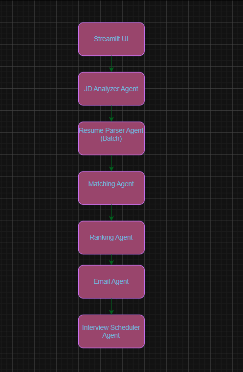

# 🤖 Intelligent Talent Acquisition Assistant

An AI-powered multi-agent hiring automation system that analyzes Job Descriptions, parses resumes, ranks candidates, generates HR emails, and schedules interviews automatically.

Built using Groq LLM (Llama 3.1), Streamlit, and a modular multi-agent architecture.

---

## 🚀 Project Overview

The Intelligent Talent Acquisition Assistant automates the complete hiring pipeline:

1. 📄 Job Description Analysis
2. 📑 Resume Parsing (Batch Processing)
3. 🎯 Skill Matching & Fit Scoring
4. 🏆 Candidate Ranking
5. 📧 Automated Email Generation
6. 📅 AI-based Interview Scheduling

This project simulates a real-world Applicant Tracking System (ATS) powered by Generative AI.

---

## 🧠 System Architecture

  

---

Each component is designed as an independent agent for modularity and scalability.

---

## 🛠️ Tech Stack

- **LLM**: Groq API (Llama-3.1-8b-instant)
- **Frontend**: Streamlit
- **Backend**: Python
- **PDF Parsing**: pdfminer
- **Environment Management**: dotenv
- **JSON Processing**: Native Python JSON
- **Architecture Style**: Multi-Agent Modular Design

---

