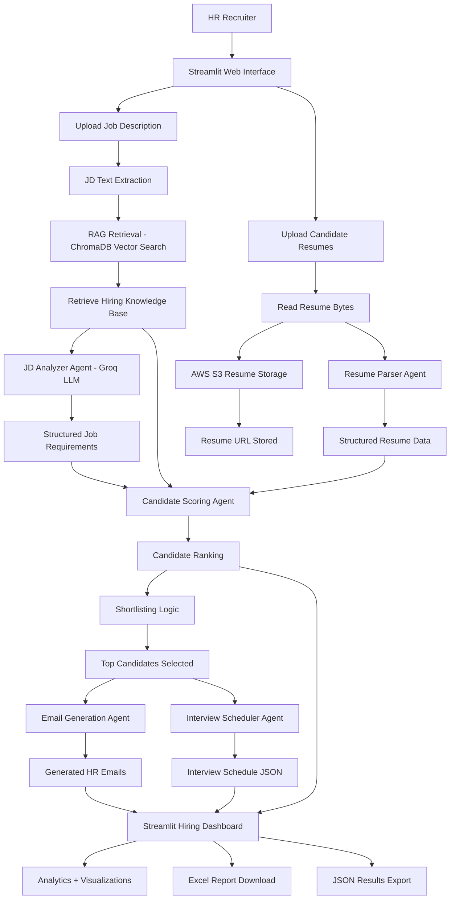

# 🤖 Intelligent Talent Acquisition Assistant

An **AI-powered multi-agent hiring automation system** that analyzes job descriptions, parses resumes, ranks candidates, generates HR emails, and schedules interviews automatically.

The system integrates **LLM reasoning, RAG knowledge retrieval, and cloud storage** to simulate a **real-world AI-powered Applicant Tracking System (ATS)**.

Built using **Groq LLM (Llama 3.1), Streamlit, ChromaDB, and AWS S3**.

---

# 🚀 Project Overview

The **Intelligent Talent Acquisition Assistant** automates the end-to-end hiring pipeline:

1. 📄 **Job Description Analysis**
2. 📑 **Resume Parsing (Batch Processing)**
3. 🧠 **RAG-based Hiring Knowledge Retrieval**
4. 🎯 **Candidate Skill Matching & Scoring**
5. 🏆 **Candidate Ranking & Shortlisting**
6. 📧 **Automated HR Email Generation**
7. 📅 **AI-based Interview Scheduling**
8. ☁️ **Cloud Resume Storage (AWS S3)**

This project demonstrates how **Generative AI agents can automate hiring workflows** used by modern recruitment platforms.

---

# 🧠 System Architecture

<p align="center">
  
</p>

Each module in the system is implemented as an **independent AI agent**, enabling a scalable **multi-agent architecture**.

---

# 🔄 System Workflow


```mermaid
flowchart TD

A[HR Recruiter] --> B[Streamlit Web Interface]

B --> C[Upload Job Description]
C --> D[JD Text Extraction]

D --> E[RAG Retrieval - ChromaDB Vector Search]
E --> F[Retrieve Hiring Knowledge Base]

F --> G[JD Analyzer Agent - Groq LLM]
G --> H[Structured Job Requirements]

B --> I[Upload Candidate Resumes]

I --> J[Read Resume Bytes]
J --> K[AWS S3 Resume Storage]
K --> L[Resume URL Stored]

J --> M[Resume Parser Agent]
M --> N[Structured Resume Data]

H --> O[Candidate Scoring Agent]
N --> O
F --> O

O --> P[Candidate Ranking]

P --> Q[Shortlisting Logic]
Q --> R[Top Candidates Selected]

R --> S[Email Generation Agent]
R --> T[Interview Scheduler Agent]

S --> U[Generated HR Emails]
T --> V[Interview Schedule JSON]

U --> W[Streamlit Hiring Dashboard]
V --> W
P --> W

W --> X[Analytics + Visualizations]
W --> Y[Excel Report Download]
W --> Z[JSON Results Export]
```

---

# ⚙️ System Components

### 1️⃣ Job Description Analyzer Agent

Uses **Groq LLM (Llama-3.1)** to extract structured hiring requirements:

```
Required Skills
Experience Required
Education Requirements
Job Role
```

---

### 2️⃣ RAG Knowledge Retrieval

The system retrieves **recruitment guidelines** from a **ChromaDB vector database**.

This allows the system to incorporate:

- hiring best practices
- evaluation criteria
- interview scheduling rules

---

### 3️⃣ Resume Parser Agent

Each uploaded resume is processed using:

```
PDF → Text Extraction → LLM Parsing
```

Extracted information includes:

```
Name
Email
Phone
Skills
Experience
Education
```

---

### 4️⃣ Candidate Scoring Agent

Candidates are evaluated based on:

```
Skill Matching
Experience Context
RAG Hiring Guidelines
```

Fit Score formula:

```
Fit Score = (Matched Skills / Required Skills) × 100
```

Candidates are ranked based on **fit score**.

---

### 5️⃣ Email Generation Agent

Automatically generates HR emails:

- Interview invitation
- Rejection email

Generated using **LLM prompt engineering**.

---

### 6️⃣ Interview Scheduler Agent

Automatically generates structured interview details:

```
Interview Date
Time Slot
Meeting Mode
Meeting Link
HR Contact
```

---

### 7️⃣ Cloud Resume Storage

Uploaded resumes are stored securely in:

```
AWS S3 Bucket
```

This allows:

- scalable resume storage
- cloud access
- resume URL generation

---

### 8️⃣ Hiring Dashboard

The Streamlit interface provides:

📊 Hiring analytics
📈 Candidate score visualization
📋 Candidate ranking table
📧 Generated email preview
📅 Interview schedule

Download options:

```
Excel report
JSON results
```

---

# 🛠️ Tech Stack

| Layer           | Technology              |
| --------------- | ----------------------- |
| Frontend        | Streamlit               |
| LLM             | Groq API (Llama-3.1-8B) |
| Vector Database | ChromaDB                |
| Embeddings      | Sentence Transformers   |
| Cloud Storage   | AWS S3                  |
| PDF Parsing     | pdfminer                |
| Backend         | Python                  |
| Architecture    | Multi-Agent AI System   |

---

# 📂 Project Structure

```
Intelligent-Talent-Acquisition-Assistant
│
├── agents
│   ├── jd_analyzer.py
│   ├── resume_parser.py
│   ├── candidate_scoring_agent.py
│   ├── email_agent.py
│   └── scheduler_agent.py
│
├── pipeline
│   └── batch_pipeline.py
│
├── rag
│   ├── build_db.py
│   ├── rag_retriever.py
│   └── knowledge_base.txt
│
├── storage
│   └── s3_storage.py
│
├── assets
│   └── UI screenshots
│
├── app.py
├── requirements.txt
├── .env
└── README.md
```

---

# 💻 Streamlit UI Interface

### Main Interface

<p align="center">
  
</p>

### Candidate Ranking Dashboard

<p align="center">
  
</p>

<p align="center">
  
</p>

<p align="center">
  
</p>

### Email Generation & Scheduling

<p align="center">
  
</p>

<p align="center">
  
</p>

<p align="center">
  
</p>

<p align="center">
  
</p>

---

# ⚡ Installation

### 1️⃣ Clone the repository

```bash
git clone https://github.com/yourusername/Intelligent-Talent-Acquisition-Assistant.git
cd Intelligent-Talent-Acquisition-Assistant
```

---

### 2️⃣ Create virtual environment

```bash
python -m venv venv
```

Activate:

```
venv\Scripts\activate
```

---

### 3️⃣ Install dependencies

```bash
pip install -r requirements.txt
```

---

### 4️⃣ Configure Environment Variables

Create a `.env` file:

```
GROQ_API_KEY=your_groq_api_key

AWS_ACCESS_KEY_ID=your_access_key
AWS_SECRET_ACCESS_KEY=your_secret
AWS_REGION=ap-south-1
AWS_BUCKET_NAME=your_bucket_name
```

---

### 5️⃣ Build RAG Vector Database

```
python rag/build_db.py
```

---

### 6️⃣ Run the Application

```
streamlit run app.py
```

---

# 🎯 Key Features

✔ Multi-Agent AI Architecture
✔ Retrieval Augmented Generation (RAG)
✔ Resume Parsing with LLM
✔ Candidate Ranking System
✔ Automated Email Generation
✔ AI Interview Scheduling
✔ AWS Cloud Resume Storage
✔ Interactive Hiring Dashboard

---

# 👩‍💻 Author

**Soumili Das**
B.Tech CSE (3rd Year)

Interests:

```
Artificial Intelligence
Generative AI
Full Stack Development
MERN Stack
```

---

# 📄 License

This project is intended for **educational and demonstration purposes**.

---
